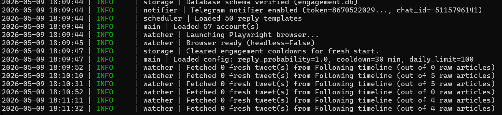
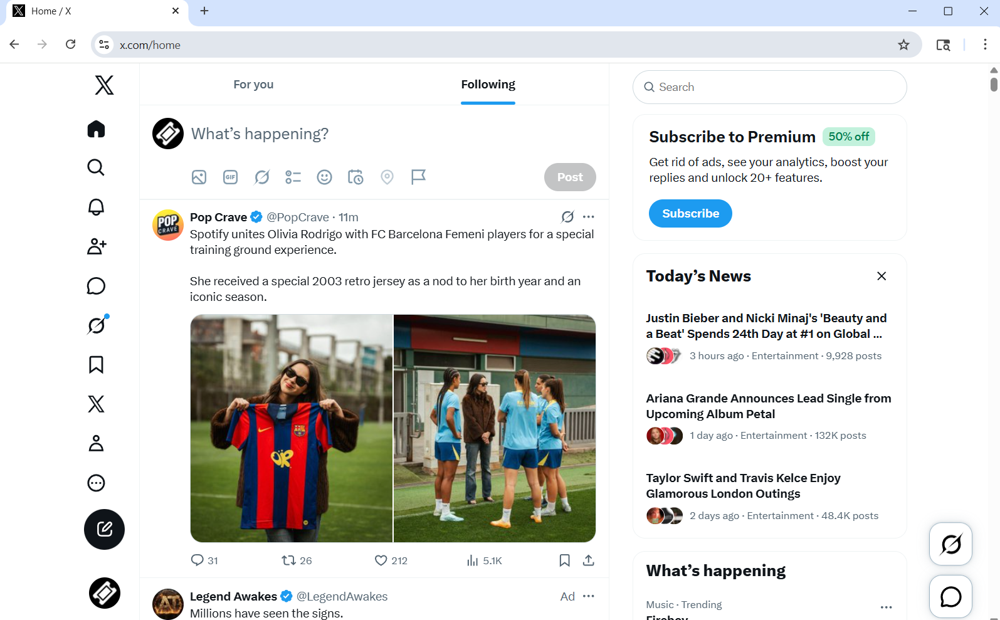
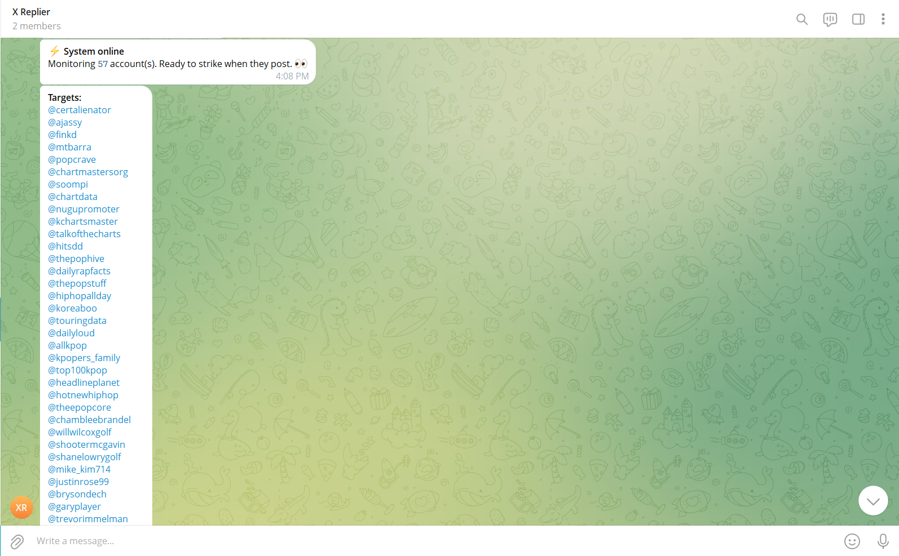
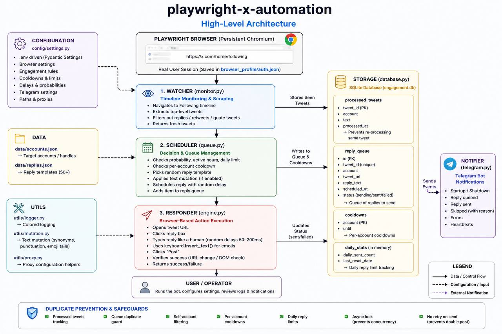

# Playwright X Automation

An asynchronous browser automation framework built with Python and Playwright for real-time X (Twitter) monitoring, queue-based task processing, and automated workflow execution.

This project demonstrates:

- Browser automation with Playwright
- Async Python architecture using asyncio
- Queue-based workflow orchestration
- SQLite persistence systems
- Duplicate prevention safeguards
- Telegram event notifications
- Human-like browser interaction simulation
- Modular automation framework design

The framework operates entirely through a real Chromium browser session and does not rely on external APIs.

---

# Features

- Real-time X timeline monitoring
- Playwright-powered Chromium automation
- Queue-based task scheduling
- SQLite persistence layer
- Duplicate reply prevention
- Per-account cooldown protection
- Configurable reply probability and delays
- Telegram notifications
- Human-like typing simulation
- Proxy support
- Persistent browser session handling
- Async task orchestration with asyncio

---

# Screenshots

## Console Logs

Shows real-time monitoring, queue processing, and runtime execution logs.



---

## Playwright Browser Automation

Visible Chromium browser running through Playwright while monitoring the X Following timeline.



---

## Telegram Notifications

Real-time Telegram alerts for queue events, successful executions, and monitoring activity.




---

## System Architecture

High-level automation architecture and workflow overview.



---

# Project Structure

```text
playwright-x-automation/
│
├── config/
│   └── settings.py
│
├── watcher/
│   └── monitor.py
│
├── scheduler/
│   └── queue.py
│
├── responder/
│   └── engine.py
│
├── storage/
│   └── database.py
│
├── notifier/
│   └── telegram.py
│
├── utils/
│   ├── logger.py
│   ├── mutation.py
│   └── proxy.py
│
├── data/
│   ├── accounts.json
│   └── replies.json
│
├── screenshots/
│
├── .env.example
├── requirements.txt
├── README.md
└── main.py
````

---

# Technology Stack

* Python
* Playwright
* SQLite
* asyncio
* Pydantic Settings
* Telegram Bot API

---

# Core Workflow

1. Launches a persistent Chromium browser session using Playwright
2. Monitors configured X timelines in real time
3. Detects new posts from configured accounts
4. Queues automated actions using scheduling logic
5. Processes queued actions asynchronously
6. Stores all state locally using SQLite
7. Prevents duplicate processing through multi-layer safeguards
8. Sends Telegram notifications for system events

---

# Duplicate Prevention & Safety Logic

The framework includes multiple safeguards to prevent duplicate actions:

* Processed tweet tracking
* Queue-level duplicate protection
* Per-account cooldown management
* Daily action limits
* Async locking to prevent concurrent execution
* Self-account filtering
* Persistent state tracking across restarts

---

# Installation

## 1. Clone the Repository

```bash
git clone https://github.com/Quiford/playwright-x-automation.git
cd playwright-x-automation
```

---

## 2. Install Dependencies

```bash
pip install -r requirements.txt
playwright install chromium
```

---

## 3. Configure Environment Variables

Copy the example configuration file:

```bash
copy .env.example .env
```

Then edit `.env` with your preferred settings.

---

## 4. Configure Target Accounts

Edit:

```text
data/accounts.json
```

Example:

```json
[
  {
    "handle": "example_account"
  }
]
```

---

## 5. Configure Reply Templates

Edit:

```text
data/replies.json
```

Add custom reply templates.

---

## 6. First Launch

```bash
py main.py
```

On first launch:

* Chromium opens automatically
* Log into X manually
* Session state is stored locally for reuse

---

# Telegram Notifications

Optional Telegram integration supports:

* Queue event notifications
* Successful execution alerts
* Failure/error alerts
* Startup/shutdown notifications

Configure in:

```text
.env
```

---

# Persistence Layer

SQLite is used for:

* Processed item tracking
* Queue management
* Cooldown storage
* Execution state persistence

This allows the framework to recover cleanly after restarts without reprocessing old items.

---

# Key Engineering Concepts Demonstrated

* Async Python architecture
* Browser automation
* Queue processing systems
* Persistent state management
* Automation workflow orchestration
* Real-time event monitoring
* Fault-tolerant task execution
* Modular Python project structure

---

# Disclaimer

This project is intended for educational purposes, browser automation experimentation, and workflow automation research only.

Users are responsible for complying with platform policies and applicable laws when operating automated systems.

---

# Author

Afolabi Yusuf Oladipupo

GitHub:
https://github.com/Quiford

```
```
